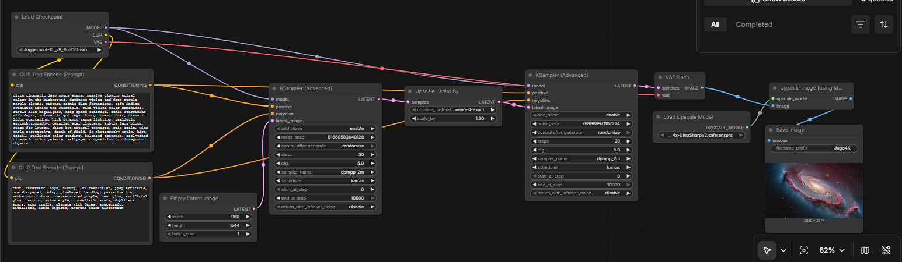

## Example – Cinematic Galaxy Deep Space (4K+ Pipeline)

### Workflow Graph

### Generated Output

---

## Overview

This workflow generates 4K scenes using a multi-stage SDXL pipeline:

1. Base generation (SDXL)
2. Latent upscale pass
3. Refiner diffusion pass
4. VAE decode
5. Optional pixel upscale (UltraSharp V2)
6. Final resize (optional, exact 4K target)

---

## Model Stack

- **Primary Model:** Juggernaut XL (SDXL-based)
- **Sampler:** DPM++ 2M
- **Scheduler:** Karras
- **Upscale Model:** 4x-UltraSharpV2 (safetensors)

Two diffusion passes are used:
- Base diffusion
- Refiner diffusion after latent upscale

---

## Workflow Structure

### 1️⃣ Base Generation
- Resolution example: 960×544 (16:9 optimized)
- Steps: 30
- CFG: 5–6

### 2️⃣ Latent Upscale
- Scale: 2×
- Example: 960×544 → 1920×1088
- Maintains structural coherence in latent space
- Minimal VRAM impact compared to pixel upscale

### 3️⃣ Refiner Pass
- Steps: 20–25
- Lower CFG for realism (5.0 recommended)
- Adds micro-detail and contrast refinement

### 4️⃣ VAE Decode
- Converts latent to RGB image

### 5️⃣ Pixel Upscale (UltraSharp V2)
- 4× ESRGAN-style upscale
- Example: 1920×1088 → 7680×4352
- Adds sharp micro-detail
- Ideal for wallpaper scaling or downsampling

If scale is set to 1 (or disabled):
- The workflow remains stable
- No structural change occurs
- Only diffusion result is exported
- Useful for native 4K generation without pixel amplification

### 6️⃣ Final Resize (Optional)
To produce exact 3840×2160:
- Add Image Resize node
- Minor vertical crop from 4352 → 2160

---

## Resolution Strategies

### Exact 4K Strategy
Base: 960×544  
Pixel upscale (4×): 3840×2176  
Resize → 3840×2160  

### High-Detail Strategy
Base: 1024×576  
Latent upscale 2×  
Pixel upscale 4×  
Resize → 4K  

### Extreme Detail (8K+)
Base: 1536×864  
Latent upscale 2×  
Pixel upscale 4×  
Output exceeds 8K resolution  

---

## Performance

- Base + Refiner steps: ~50 total
- Generation time: 15–25 seconds
- VRAM usage: 8–11GB (depending on resolution)
- Pixel upscale VRAM spike minimal
- Tested on RTX 5070 (12GB)

---

## Technical Notes

- Resolution must remain divisible by 8 (latent constraint)
- SDXL internal latent space operates at /8 scale
- UltraSharp uses fixed 4× scaling
- For exact aspect ratio wallpapers, final resize is recommended
- Lower CFG produces more astrophotography realism
