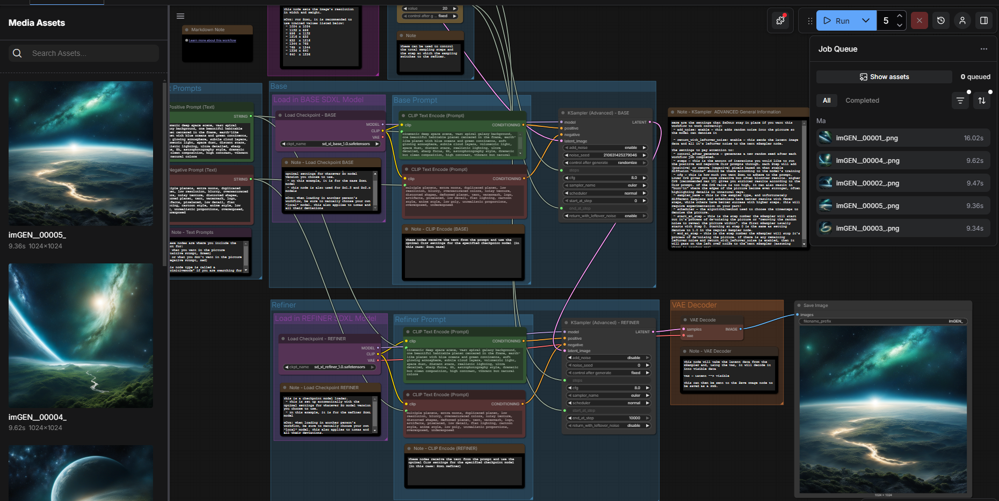

## Example – Cinematic Galaxy Planet Generation

### Workflow Graph

### Generated Output

### Prompt Configuration

**Positive Prompt**
cinematic deep space scene, vast spiral galaxy background, one beautiful habitable planet centered in the frame, earth-like planet with blue oceans and green continents, soft glowing atmosphere, subtle cloud layers, volumetric light, space dust, distant stars, realistic lighting, ultra detailed, sharp focus, 8k, astrophotography style, dramatic but clean composition, high contrast, vibrant but natural colors

**Negative Prompt**
multiple planets, extra moons, duplicated planet, low resolution, blurry, oversaturated colors, noisy texture, distorted shapes, deformed planet, text, watermark, logo, artifacts, pixelated, low detail, flat lighting, cartoon style, anime style, low poly, unrealistic proportions, overexposed, underexposed

## Workflow Structure

- Base SDXL model
- Advanced KSampler configuration
- Refiner SDXL pass
- VAE decode & image export
- Deterministic seed control

## Performance

- Resolution: 1024x1024
- Steps: 30–40 (Base + Refiner)
- CFG: 6–8
- Generation time: ~9–16 seconds
- VRAM usage: ~8–10GB
- Tested on RTX 5070 (12GB)