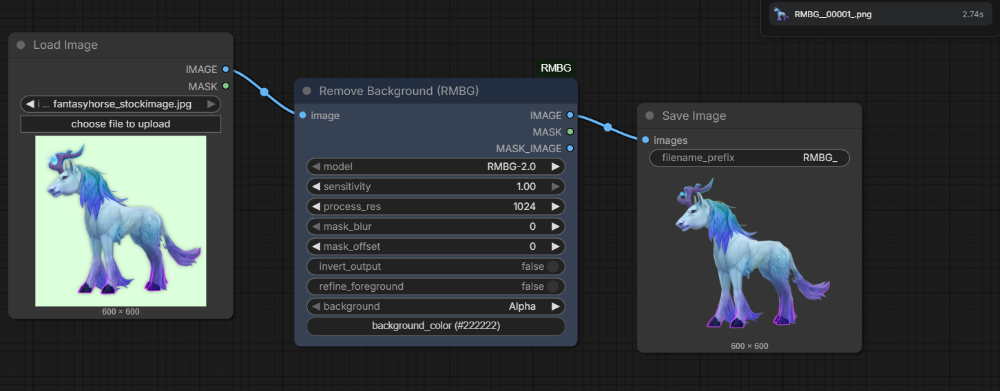

## Example – Background Removal Pipeline

### Workflow Graph

### Input Image

### Output (Background Removed)

## Performance
- Processing time: ~2–5 seconds
- VRAM usage: ~2–4GB
- Supports transparent PNG output
- Tested on RTX 5070 (12GB)