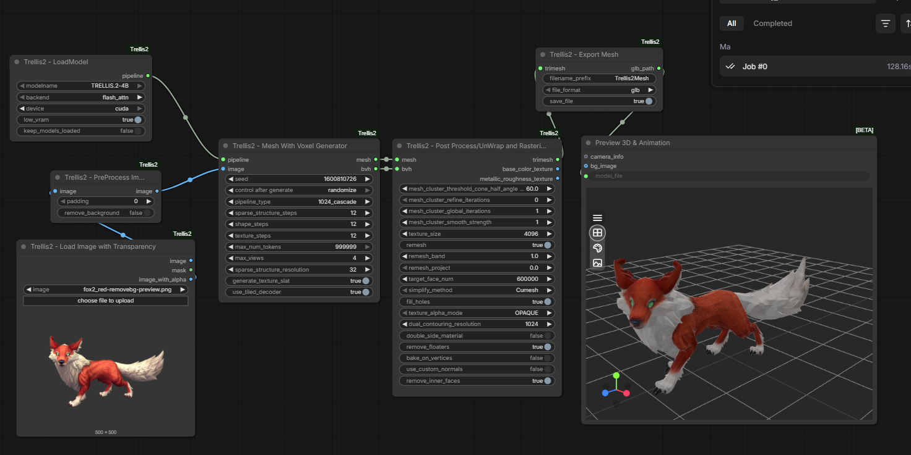
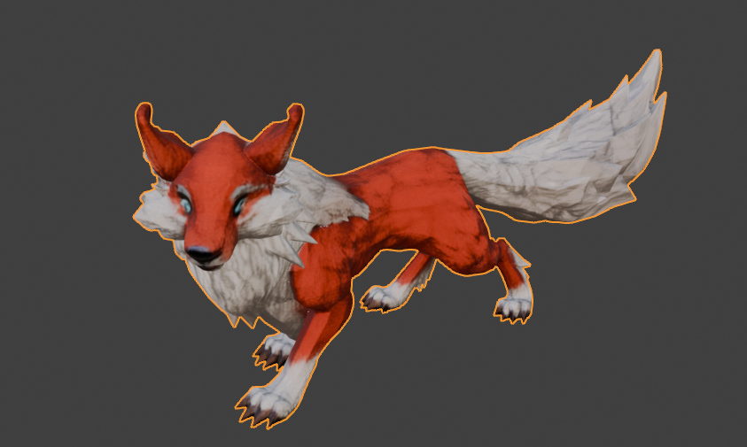
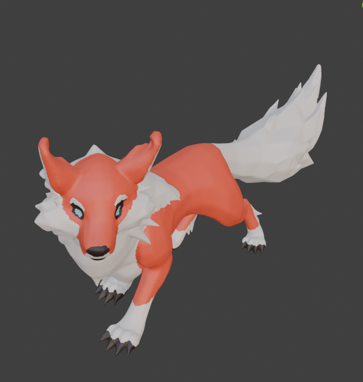

## Example – Trellis2 3D Reconstruction

### Workflow Graph

### Generated Mesh Preview

### Printable Optimized Version

## Performance
- Generation time: ~2 minutes
- VRAM usage: ~10–11GB
- Tested on RTX 5070 (12GB)
